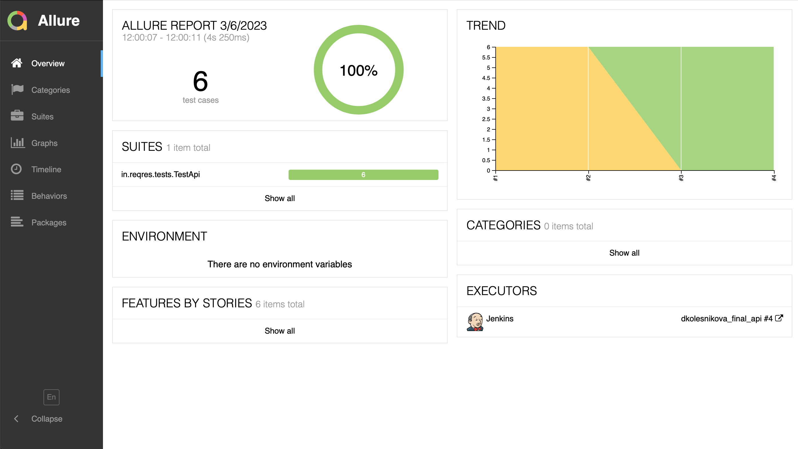
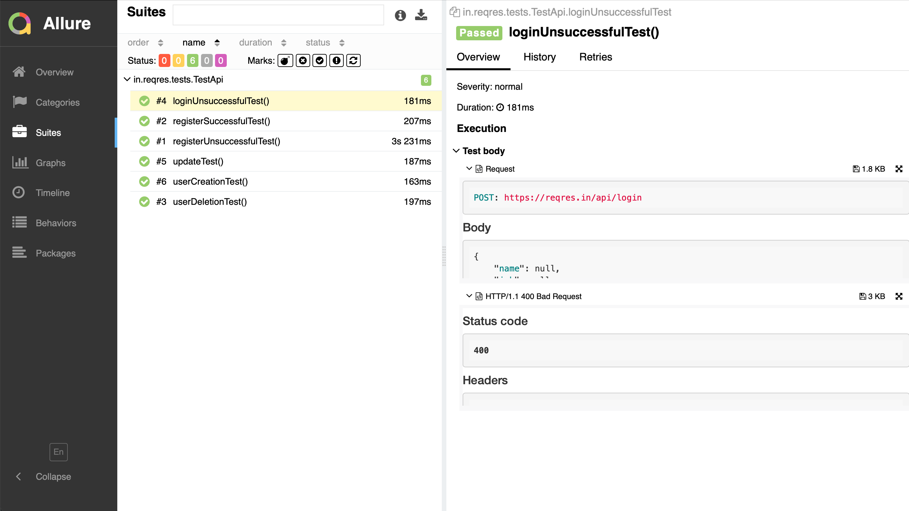
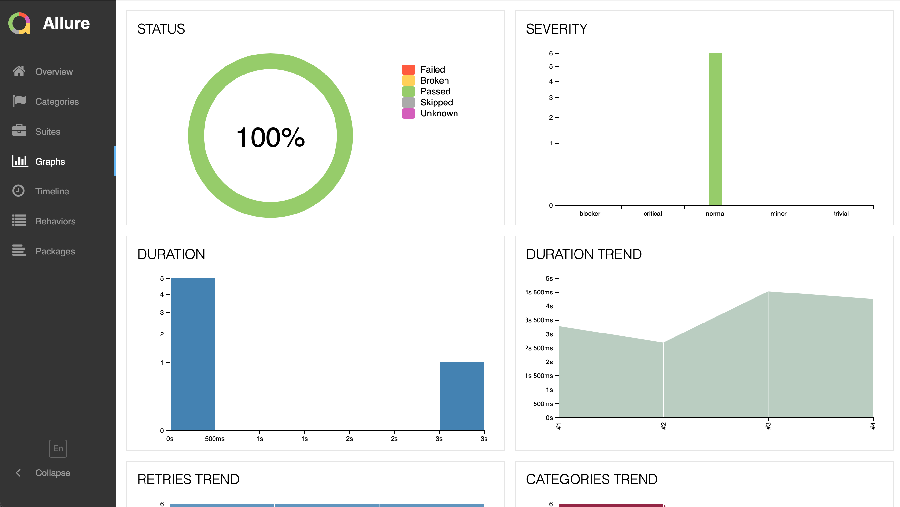
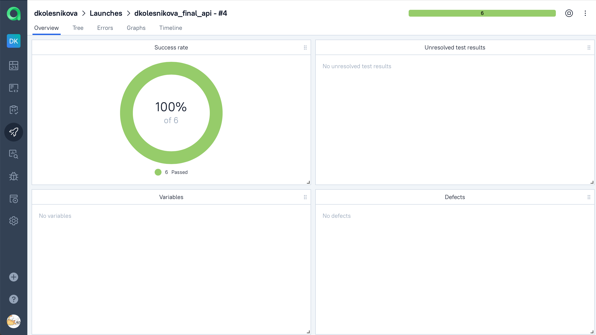
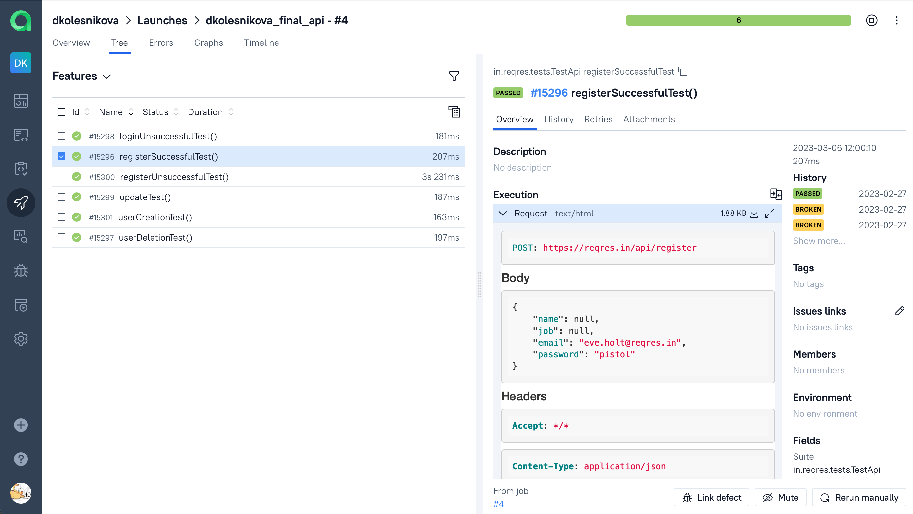
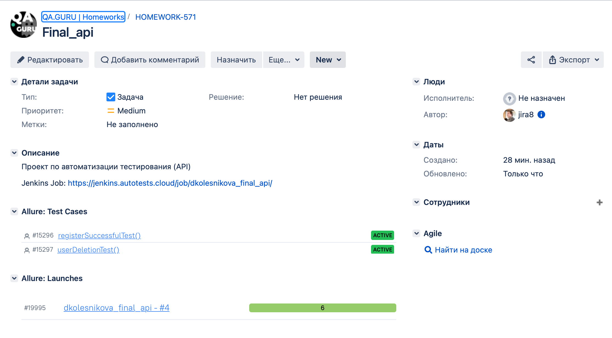
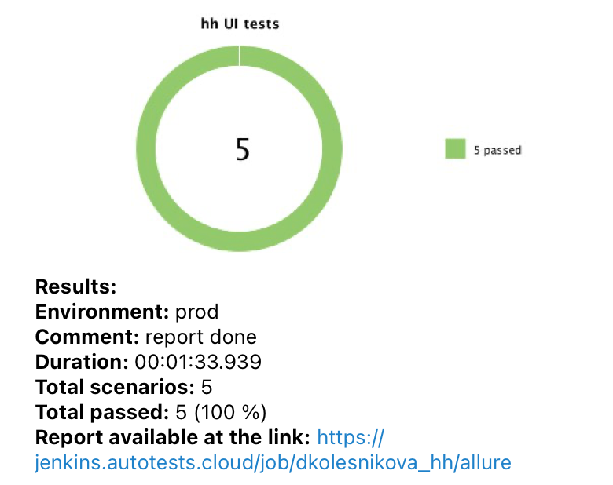

# Проект по автоматизации тестирования API
<a target="_blank" href="https://reqres.in">Вэб сайт reqres.in </a>

## :pushpin: Содержание:

- [Технологии и инструменты](#earth_africa-технологии-и-инструменты)
- [Реализованные проверки](#earth_africa-Реализованные-проверки)
- [Сборка в Jenkins](#earth_africa-Jenkins-job)
- [Запуск из терминала](#earth_africa-Запуск-тестов-из-терминала)
- [Allure отчет](#earth_africa-Allure-отчет)
- [Интеграция с Allure TestOps](#earth_africa-Интеграция-с-Allure-TestOps)
- [Интеграция с Jira](#earth_africa-Интеграция-с-Jira)
- [Отчет в Telegram](#earth_africa-Уведомление-в-Telegram-при-помощи-бота)

## :electric_plug:Технологии и инструменты

<p align="center">
<a href="https://www.jetbrains.com/idea/"></a>
<a href="https://www.java.com/"></a>
<a href="https://github.com/"></a>
<a href="https://junit.org/junit5/"></a>
<a href="https://gradle.org/"></a>
<a href="https://selenide.org/"></a>
<a href="https://aerokube.com/selenoid/"></a>
<a href="https://github.com/allure-framework/allure2"></a>
<a href="https://qameta.io/"></a>
<a href="https://www.atlassian.com/ru/software/jira"></a>
<a href="https://www.jenkins.io/"></a>
</p>

## :mag: Реализованные проверки

- ✓ Проверка создания пользователя.
- ✓ Проверка успешной регистрации пользователя.
- ✓ Проверка ошибки регистрации пользователя.
- ✓ Проверка изменения данных.
- ✓ Проверка ошибки авторизации пользователя.

##  :rocket: Запуск тестов

### Локальный запуск тестов

```bash
gradle clean test
```

### Удаленный запуск тестов

```bash
gradle clean test 
-Dbrowser=${BROWSER}
-DbrowserVersion=${BROWSER_VERSION}
-DbrowserSize=${BROWSER_SIZE}
-DremoteUrl=${REMOTE_URL}
-DbaseUrl=${BASE_URL}
```

### Параметры сборки

> <code>REMOTE_URL</code> – адрес удаленного сервера, на котором будут запускаться тесты.
>
> <code>BROWSER</code> – браузер, в котором будут выполняться тесты .
>
> <code>BROWSER_VERSION</code> – версия браузера, в которой будут выполняться тесты .
>
> <code>BROWSER_SIZE</code> – размер окна браузера, в котором будут выполняться тесты .

###  Удаленный запуск (в Jenkins):
1. Открыть <a target="_blank" href="https://jenkins.autotests.cloud/job/dkolesnikova_hh/">проект</a>


2. Выбрать пункт **Собрать с параметрами**
3. В случае необходимости изменить параметры, выбрав значения из выпадающих списков
4. Нажать **Собрать**
5. Результат запуска сборки можно посмотреть в отчёте Allure


## </a> Отчет в <a target="_blank" href="https://jenkins.autotests.cloud/job/dkolesnikova_hh/2/allure/#">Allure report</a>

###  Главное окно

<p align="center">

</p>

###  Тесты

<p align="center">

</p>

###  Графики

<p align="center">

</p>


## </a> Интеграция с <a target="_blank" href="https://allure.autotests.cloud/launch/18382">Allure TestOps</a>

### Dashboard с  результатами тестирования
<p align="center">

</p>

### Пример отчёта выполнения одного из автотестов
<p align="center">

</p>

## </a> Интеграция с <a target="_blank" href="https://jira.autotests.cloud/browse/HOMEWORK-502">Atlassian Jira</a>
<p align="center">

</p>

## </a> Уведомление в Telegram о результатах прогона тестов

<p align="center">

</p>

